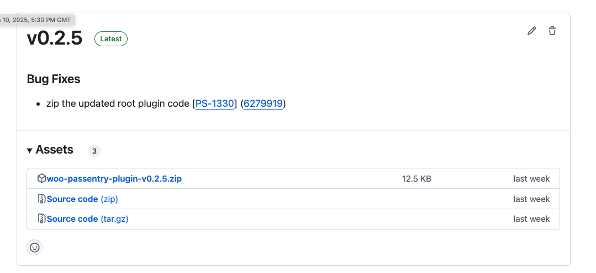
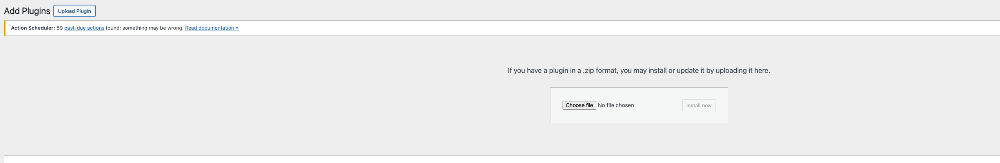
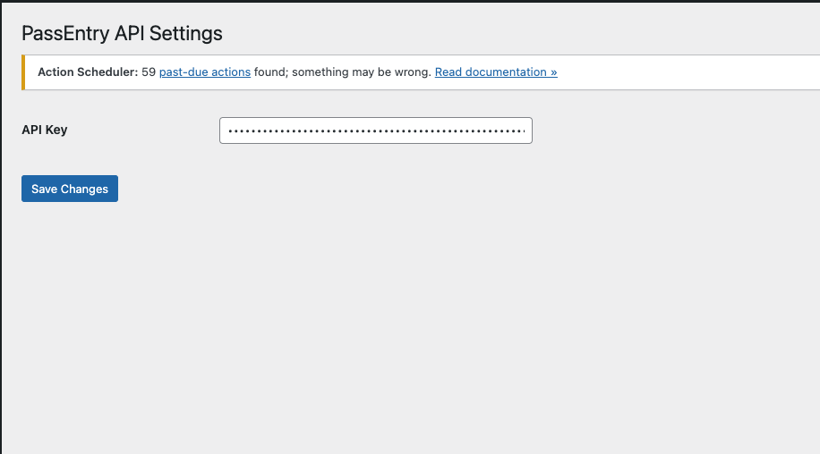
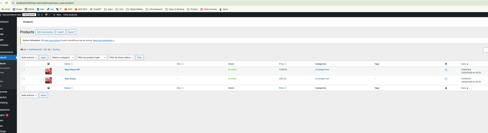
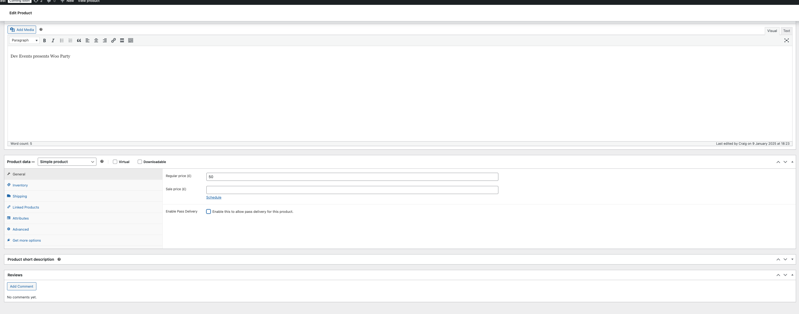
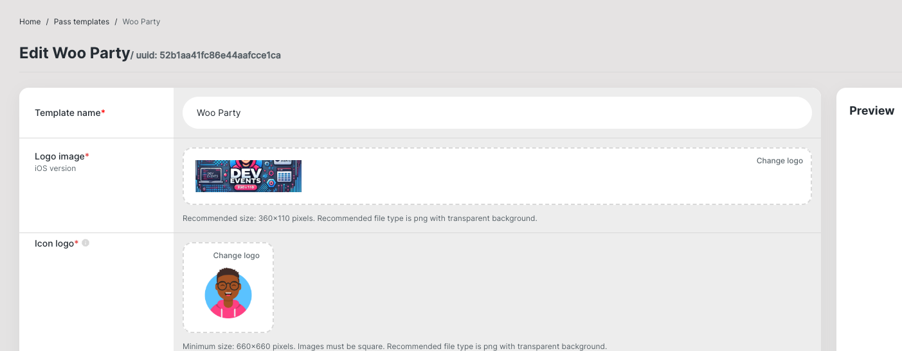
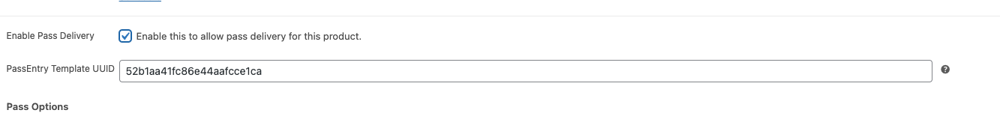
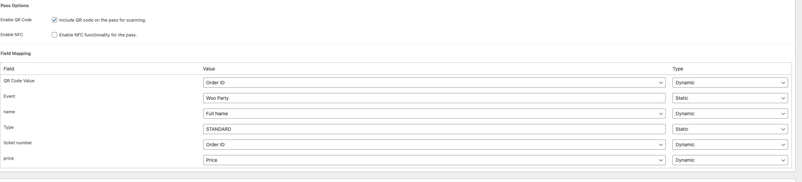
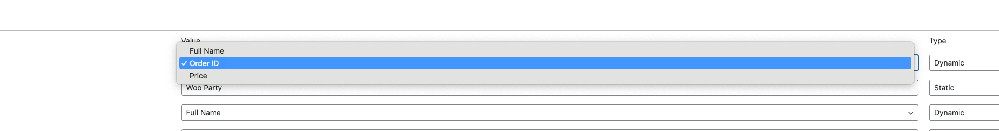
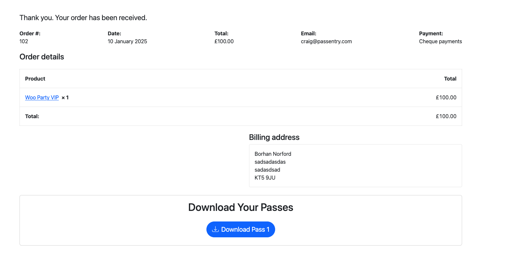

# Getting Started

## Download the plugin
go to github url and download the zip file from the latest release

## Activate the plugin

uplaod and activate the plugin in your wordpress site

## Add the API key

Go to the settings page and add your passentry API key

## Enable pass delivery

Head to your products and enable pass delivery for the product you want to deliver a digital wallet pass to the user

in the next few steps we'll look at configuring the pass for the product

## Choose template

Choose a pass template in the pass entry dashboard and copy the template uuid. 

This can be seen at the top of the pass template edit page

Enter the template uuid on the edit pruduct page which will unlock the fields section for you to decide what values will be displayed on the pass

## Add Field Values

### Static values

Static values are values that are the same for all passes. These are entered in the field values section on the edit product page

### Dynamic values

Dynamic values are values that are different for each pass. These values are generated at the point of purchase and are not know when the product is being set up. For example customer name. 

## User download

Once the product has been purchased the user will be able to download their pass from the order page.

